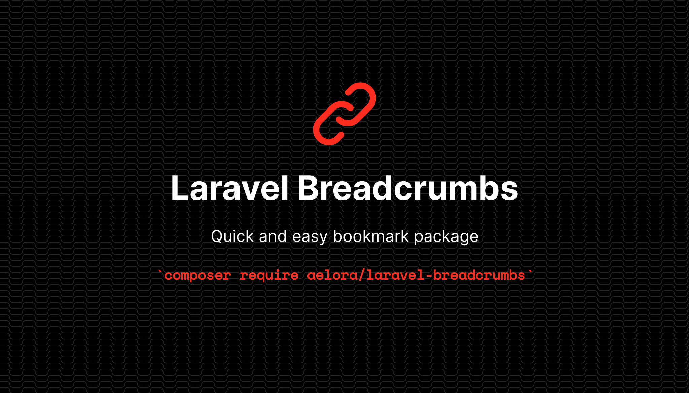

[](https://packagist.org/packages/aelora/laravel-breadcrumbs)
[](https://packagist.org/packages/aelora/laravel-breadcrumbs)

Quickly build breadcrumb trails for your pages in Laravel and automatically output the HTML and JSON-LD schema metadata. 

## Installation

You can install the package via composer:

```bash
composer require aelora/laravel-breadcrumbs
```

You can publish the config file with:

```bash
php artisan vendor:publish --tag="breadcrumbs-config"
```

This is the contents of the published config file:

```php
return [
    'home' => [

        // Should the home link be automatically included in the breadcrumbs? You can also manually include
        // or exclude the home link when you build the breadcrumb class.
        'include' => true,

        'text' => 'Home',

        'url' => url('/'),

        'image' => '',
    ],

    // Which blade template to use. Currently only tailwind is supported. 
    'theme' => 'tailwind',

    // View to use to generate the HTML breadcrumbs. If defined, this will
    // override the theme above.
    'view' => '',

    // Character to use as a separator between crumbs. Use and encoded entity
    // if you want something like > 
    'separator' => '/',
];
```

Optionally, you can publish the views using

```bash
php artisan vendor:publish --tag="breadcrumbs-views"
```

Currently the only two views are `jsonld.blade.php` which is used for the Schema metadata and `breadcrumbs-tailwind.blade.css`.

## Usage

```php
// In your controller
use Aelora\Breadcrumbs\Breadcrumbs;
$breadcrumbs = Breadcrumbs::create()
    ->add('Page #1', url('/page-1'))
    ->add('Page #2', url('/page-2'))
    ->add('Current Page');

return view('some.view.file', ['breadcrumbs' => $breadcrumbs]);
```

```php
// In your view where ever your want the breadcrumbs
{!! $breadcrumbs !!}
```

You can also call `$breadcrumbs->generate()` for the same effect. `Breadcrumbs` implements `Stringable` and has a `__toString()` method, so you don't need to. The `__toString()` calls `generate()`. 

Note that we're using `{!!` and `!!}` instead of `{{` and `}}`. We don't want the contents of the breadcrumbs to be escaped. 

### Home Page

You don't need to explicitly add your home page to the breadcrumbs. With the default config, it will be added automatically as the first element before output. If you don't want to include the home page link you can set `home.include` to `false` in the config file or call `setHome(false)` when you're creating the breadcrumbs. 

## Methods

`public function add(string $title, string $url = '', string $image = '')`

Adds a new breadcrumb link on the end of the current stack. 

The only required parameter is `$title`. Breadcrumbs will only be links if `$url` is not empty. If it is, `$title` will display unlinked. `$image` is a link to an image for the breadcrumb. It's currently only used in the schema metadata and not in the visible HTML output, although it could be if you build your own view. 

`public function count()`

Returns the number of breadcrumb items, not counting the home link.

`public static function create()`

Returns a new instance so you can build on one line without having to call `new Breadcrumbs()`.

`public function generate($echo = false)`

Returns the generated breadcrumbs, both the visible HTML and schema metadata. If `$echo` is `true` then the breadcrumbs will also be echoed prior to return. 

`public function reset()`

Clears the breadcrumb trail. 

`public function reverse()`

Reverses the internal breadcrumb trail. Sometimes it's easier to build the trail backwards and then flip it at the end. 

`public function setHome($title, string $url = '', string $image = '')`

Allows you to change the home link for individual pages without having to change the config file. Parameters are the same as the `add` method. 

If `$title` is `false` then the home link will not be included. Otherwise it should be a `string`. 

## Changelog

Please see [CHANGELOG](CHANGELOG.md) for more information on what has changed recently.

## Contributing

Please see [CONTRIBUTING](https://github.com/RyanNutt/.github/blob/main/CONTRIBUTING.md) for details.

## Credits

- [Ryan Nutt](https://github.com/RyanNutt)
- [All Contributors](../../contributors)

## License

The MIT License (MIT). Please see [License File](LICENSE.md) for more information.
